Mosiko - Advanced native Android music player

<b>Overview</b>

Mosiko lets play any local audio files on your device. Mosiko is designed to bring better experience to user when they listen to music. 
Mosiko scans all music automatically and group them by title, artist, album. With its advanced and powerful features you can create or customize your playlist, set a sleep timer and quick search. 
 

<b>Features</b>
<ul>
	<li>Kotlin Language: This project is developed in Kotlin language with Google latest guideline and material design.</li>
    	<li>Background playback</li>
	<li>Search for songs, albums, artists and playlists</li>
	<li>Bookmark artists and albums</li>
	<li>Local playlist management</li>
	<li>Reorder songs in playlist or queue</li>
	<li>Light/Dark themes</li>
	<li>Skip silence</li>
	<li>Sleep timer</li>
</ul>

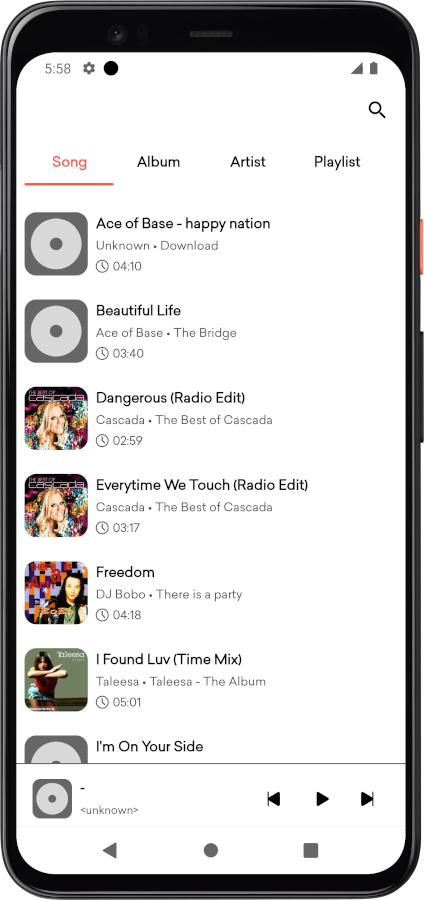
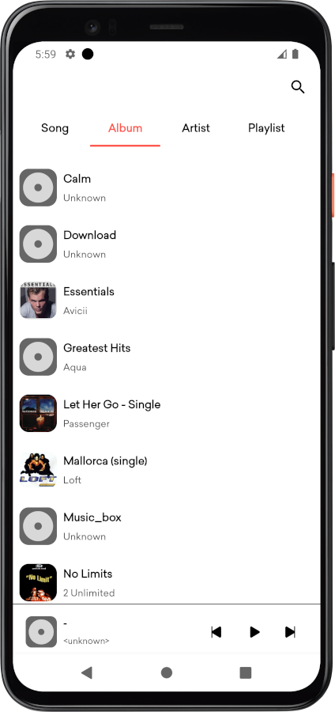
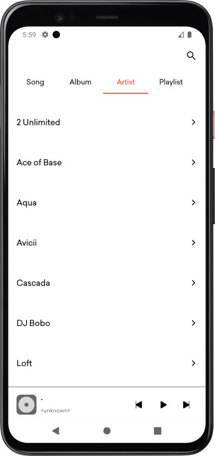
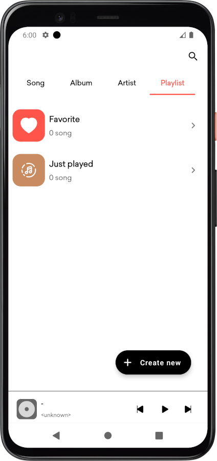
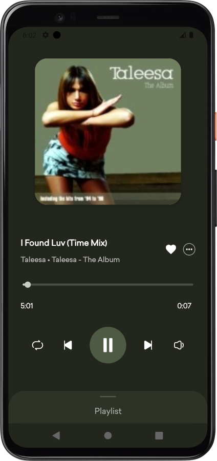
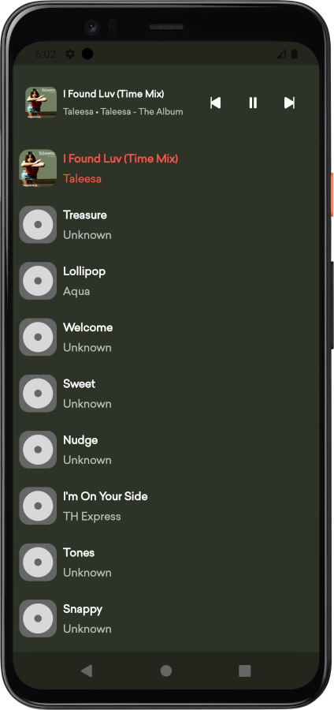
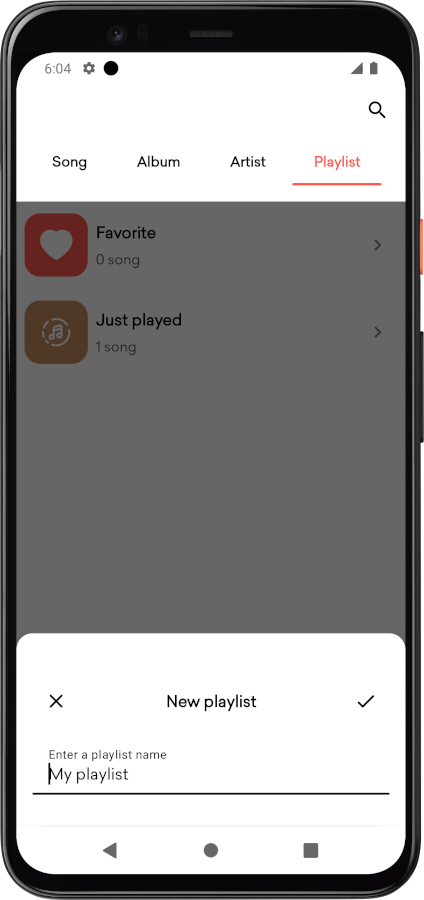
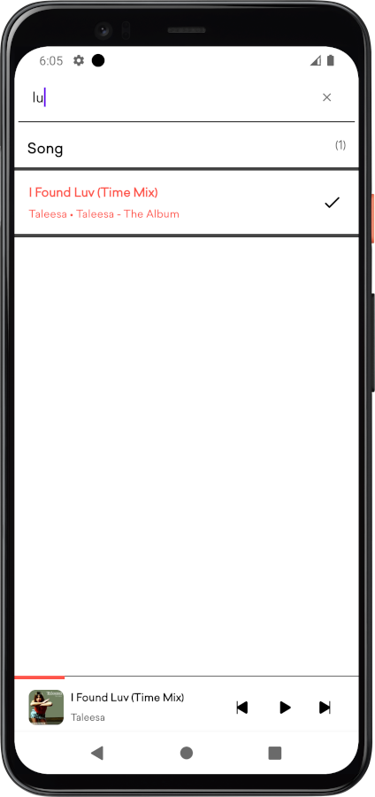
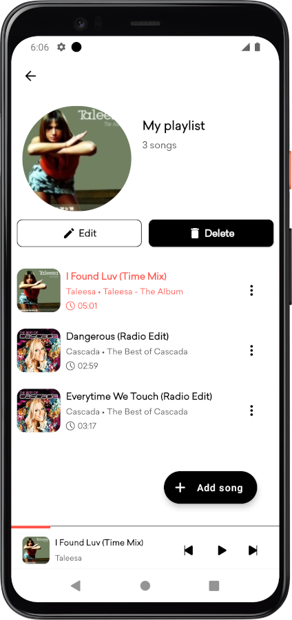
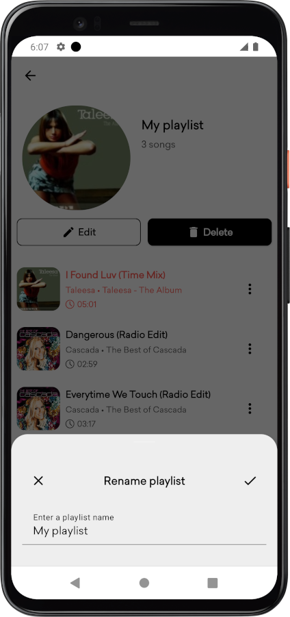
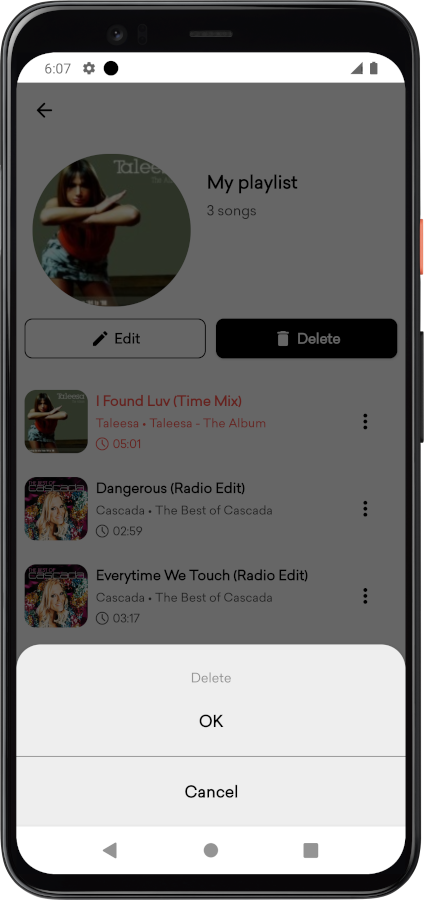
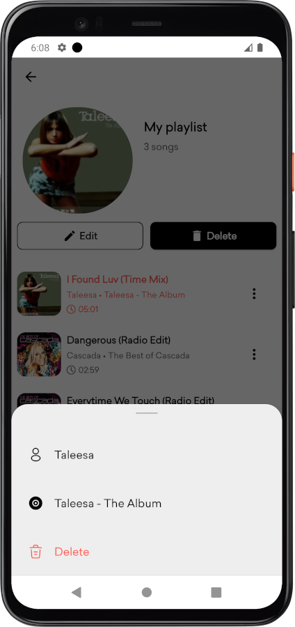
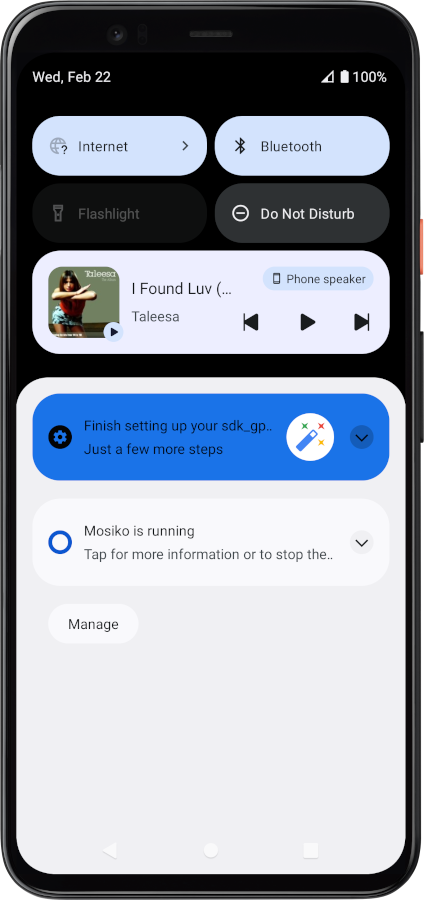
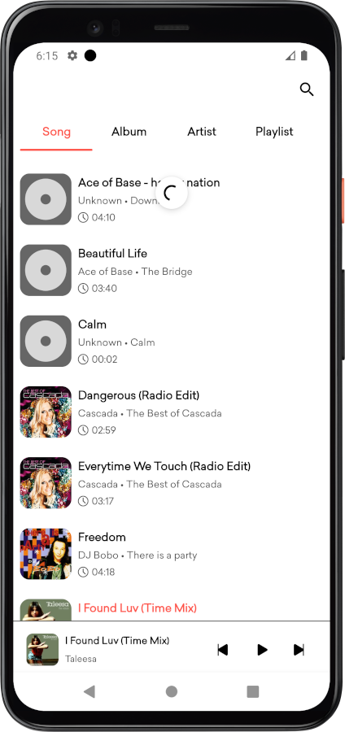
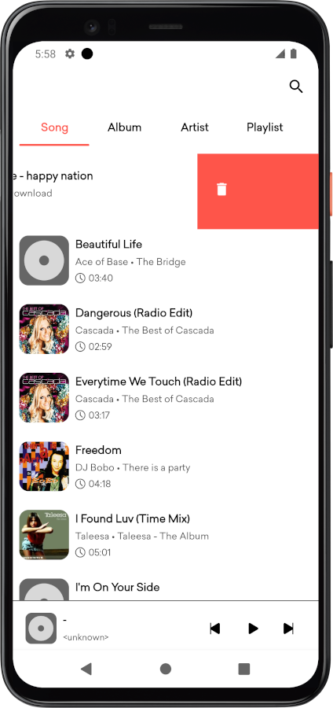
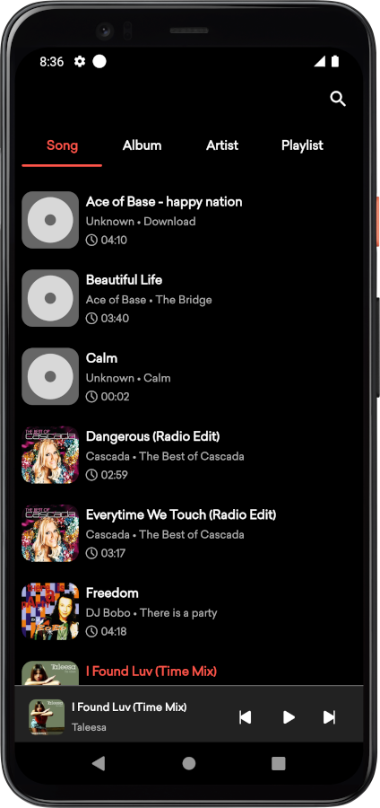
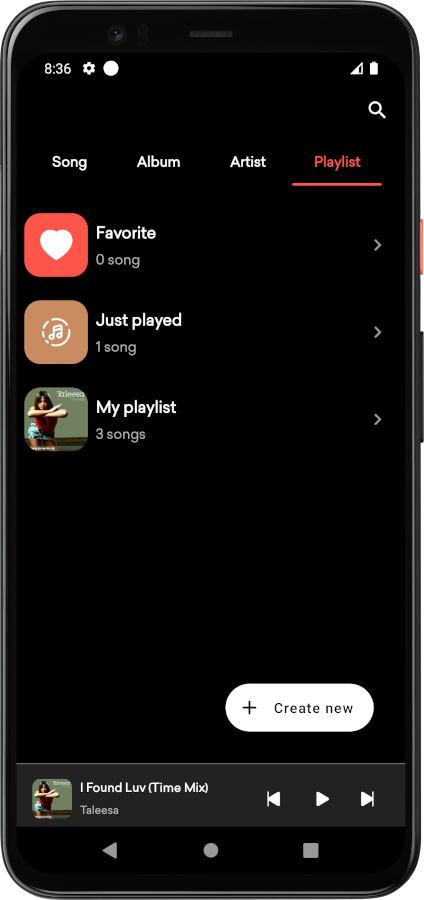
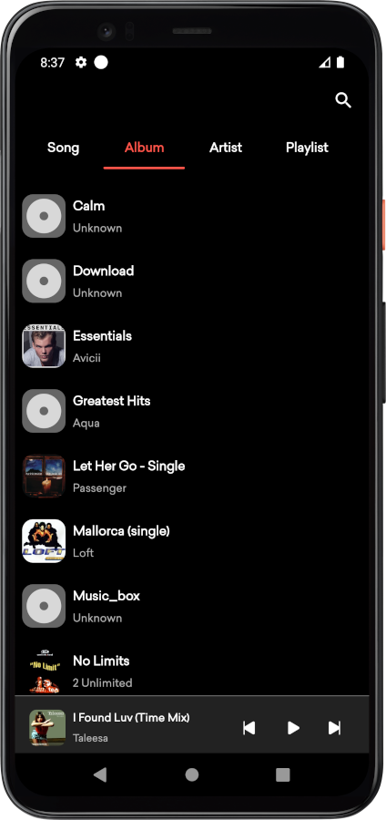

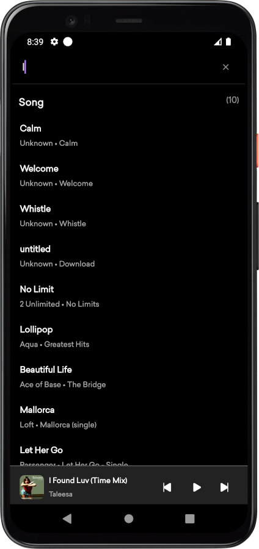
